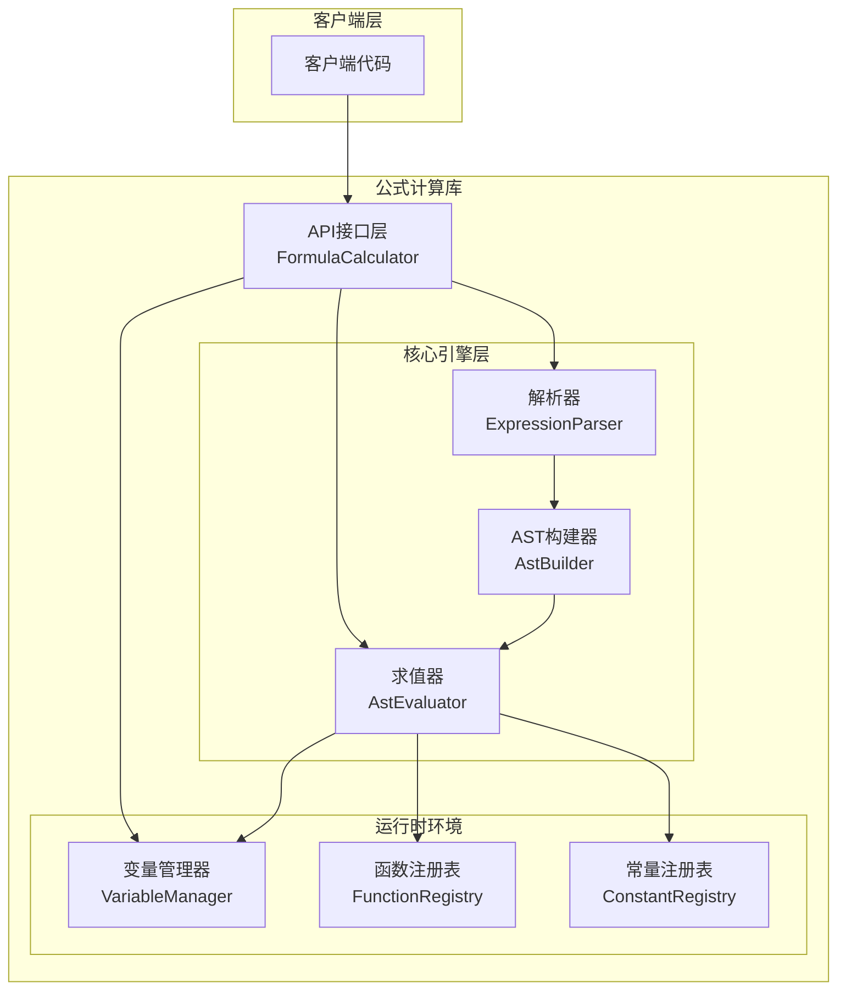
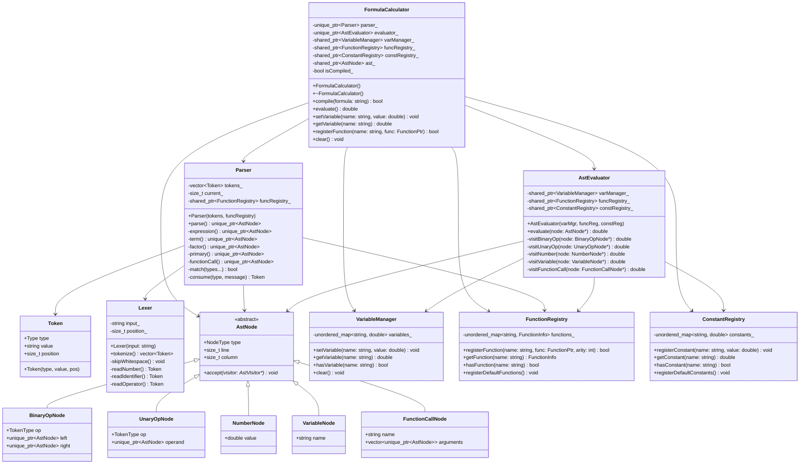
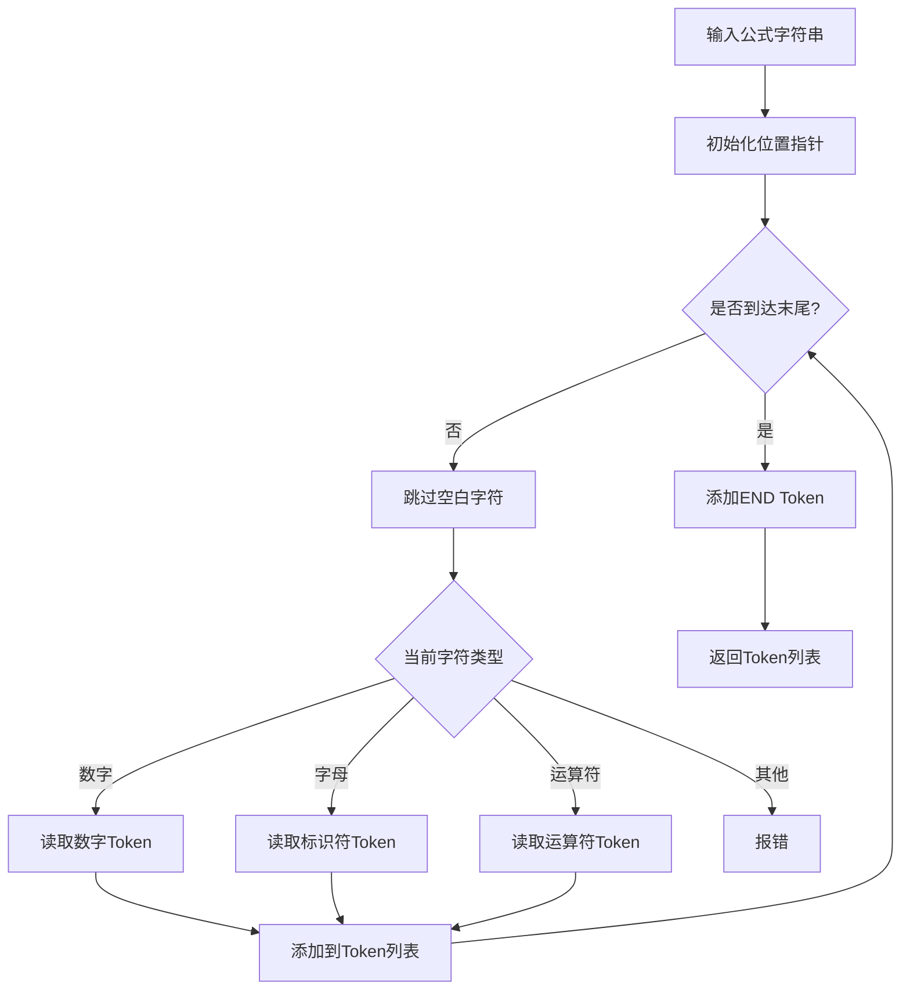
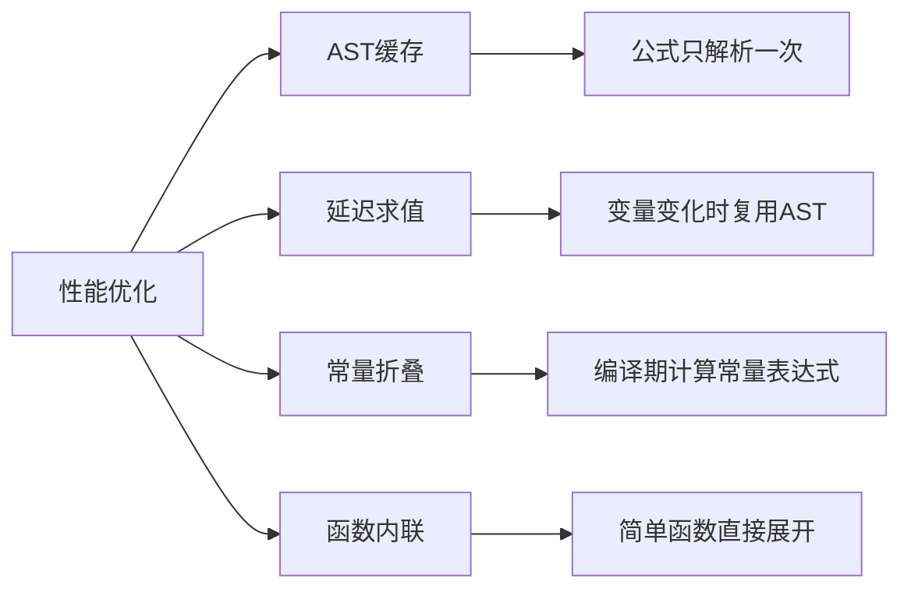

# 公式计算动态库设计文档

## 1. 项目概述

### 1.1 项目目标
开发一个高性能、可扩展的 C++ 公式计算动态库，支持数学表达式的解析和求值。

### 1.2 核心功能
- 数学表达式解析
- 变量管理和绑定
- 数学函数支持
- 高性能计算
- **比较运算**：支持 `>`, `<`, `==`, `>=`, `<=`, `!=`
- **逻辑运算**：支持 `&&` (逻辑与), `||` (逻辑或), `!` (逻辑非)
- **条件判断**：支持三元运算符 `condition ? trueValue : falseValue`
- **多类型支持**：支持 `bool`, `int`, `double` 三种数据类型，自动类型转换

### 1.3 技术选型决策

#### 解析策略选择：**自研表达式解析器**

| 方案 | 优点 | 缺点 | 结论 |
|------|------|------|------|
| muparser | 成熟稳定，功能丰富 | 依赖外部库，定制受限 | 不推荐 |
| 自研解析器 | 完全可控，零依赖，可深度定制 | 开发工作量大 | **推荐** |

**选择自研解析器的理由：**
1. **零依赖**：减少外部依赖，便于部署和维护
2. **完全可控**：可根据需求灵活扩展功能
3. **学习价值**：深入理解编译原理和表达式解析
4. **性能优化**：针对特定场景进行深度优化

---

## 2. 系统架构设计

### 2.1 整体架构



### 2.2 模块职责划分

| 模块 | 职责 | 核心类 |
|------|------|--------|
| API接口层 | 对外提供简洁的接口 | `FormulaCalculator` |
| 词法分析 | 将公式字符串转换为Token序列 | `Lexer`, `Token` |
| 语法分析 | 将Token序列解析为AST | `Parser`, `AstNode` |
| 语义分析 | 类型检查和符号解析 | `SemanticAnalyzer` |
| 求值引擎 | 遍历AST并计算结果 | `AstEvaluator` |
| 运行时环境 | 管理变量、函数、常量 | `VariableManager`, `FunctionRegistry`, `ConstantRegistry` |

---

## 3. 核心类设计

### 3.1 类图



### 3.2 详细类说明

#### 3.2.1 FormulaCalculator（主入口类）

```cpp
/**
 * 公式计算器主类
 * 提供公式编译、求值、变量管理等功能
 */
class FormulaCalculator {
public:
    FormulaCalculator();
    ~FormulaCalculator();

    // 编译公式，将公式字符串解析为内部表示
    bool compile(const std::string& formula);

    // 计算已编译公式的结果（返回 Value 类型支持多类型）
    Value evaluate();

    // 变量管理（统一使用 Value 类型）
    void setVariable(const std::string& name, const Value& value);
    Value getVariable(const std::string& name);
    bool hasVariable(const std::string& name);

    // 自定义函数注册
    using FunctionPtr = std::function<double(const std::vector<double>&)>;
    bool registerFunction(const std::string& name, FunctionPtr func, int arity);

    // 获取编译错误信息
    std::string getLastError() const;

    // 清空状态
    void clear();

private:
    std::unique_ptr<Parser> parser_;
    std::unique_ptr<AstEvaluator> evaluator_;
    std::shared_ptr<VariableManager> varManager_;
    std::shared_ptr<FunctionRegistry> funcRegistry_;
    std::shared_ptr<ConstantRegistry> constRegistry_;
    std::shared_ptr<AstNode> ast_;
    std::string lastError_;
    bool isCompiled_;
};
```

#### 3.2.2 Token（词法单元）

```cpp
/**
 * Token 类型枚举
 */
enum class TokenType {
    // 字面量
    NUMBER,         // 数字
    IDENTIFIER,     // 标识符（变量名、函数名）
    BOOLEAN,        // 布尔值 (true/false)

    // 算术运算符
    PLUS,           // +
    MINUS,          // -
    MULTIPLY,       // *
    DIVIDE,         // /
    MODULO,         // %
    POWER,          // ^

    // 一元运算符
    UNARY_PLUS,     // 一元 +
    UNARY_MINUS,    // 一元 -

    // 比较运算符
    GREATER,        // >
    LESS,           // <
    EQUAL,          // ==
    GREATER_EQUAL,  // >=
    LESS_EQUAL,     // <=
    NOT_EQUAL,      // !=

    // 逻辑运算符
    LOGICAL_AND,    // &&
    LOGICAL_OR,     // ||
    LOGICAL_NOT,    // !

    // 三元运算符
    QUESTION,       // ?
    COLON,          // :

    // 括号
    LEFT_PAREN,     // (
    RIGHT_PAREN,    // )

    // 逗号（函数参数分隔）
    COMMA,          // ,

    // 结束标记
    END,            // 输入结束
    INVALID         // 无效Token
};

/**
 * Token 结构
 */
struct Token {
    TokenType type;
    std::string value;
    size_t position;

    Token(TokenType t, const std::string& v, size_t pos)
        : type(t), value(v), position(pos) {}
};
```

#### 3.2.3 Lexer（词法分析器）

```cpp
/**
 * 词法分析器
 * 将公式字符串转换为 Token 序列
 */
class Lexer {
public:
    explicit Lexer(const std::string& input);

    // 执行词法分析，返回 Token 列表
    std::vector<Token> tokenize();

private:
    std::string input_;
    size_t position_;

    void skipWhitespace();
    Token readNumber();
    Token readIdentifier();
    Token readOperator();
    char peek() const;
    char advance();
    bool isAtEnd() const;
};
```

#### 3.2.4 Value（多类型值系统）

```cpp
/**
 * 值类型枚举
 */
enum class ValueType {
    BOOL,      // 布尔类型
    INT,       // 整数类型 (int64_t)
    DOUBLE     // 浮点类型 (double)
};

/**
 * Value 类 - 支持 bool/int/double 三种类型的统一值类型
 * 使用 union 存储不同数值类型，支持自动类型转换
 */
class Value {
public:
    // 构造函数
    Value();                         // 默认构造为 false (bool)
    Value(bool value);               // 从 bool 构造
    Value(int value);                // 从 int 构造
    Value(int64_t value);            // 从 int64_t 构造
    Value(double value);             // 从 double 构造

    // 类型查询
    ValueType getType() const { return type_; }
    bool isBool() const { return type_ == ValueType::BOOL; }
    bool isInt() const { return type_ == ValueType::INT; }
    bool isDouble() const { return type_ == ValueType::DOUBLE; }

    // 类型转换（自动转换规则）
    bool asBool() const;             // 转为 bool：0/false 为假，其他为真
    int64_t asInt() const;           // 转为 int：double 截断，bool 转 0/1
    double asDouble() const;         // 转为 double：int 直接转，bool 转 0.0/1.0

    // 输出支持
    friend std::ostream& operator<<(std::ostream& os, const Value& value);

    // 比较运算（支持不同类型间的比较）
    static int compare(const Value& lhs, const Value& rhs);

private:
    ValueType type_;
    union {
        bool boolValue_;
        int64_t intValue_;
        double doubleValue_;
    };
};
```

**类型转换规则：**

| 原始类型 | 目标类型 | 转换规则 |
|----------|----------|----------|
| bool → int | int64_t | false → 0, true → 1 |
| bool → double | double | false → 0.0, true → 1.0 |
| int → bool | bool | 0 → false, 非0 → true |
| int → double | double | 直接转换 |
| double → bool | bool | 0.0 → false, 非0 → true |
| double → int | int64_t | 向零截断取整 |

#### 3.2.5 AstNode（抽象语法树节点）

```cpp
/**
 * AST 节点类型枚举
 */
enum class NodeType {
    BINARY_OP,      // 二元运算
    UNARY_OP,       // 一元运算
    NUMBER,         // 数字字面量
    VARIABLE,       // 变量
    FUNCTION_CALL,  // 函数调用
    TERNARY_OP      // 三元运算（条件表达式）
};

/**
 * AST 节点基类
 */
class AstNode {
public:
    virtual ~AstNode() = default;

    NodeType getType() const { return type_; }
    size_t getLine() const { return line_; }
    size_t getColumn() const { return column_; }

    // 访问者模式接口 - 返回 Value 类型支持多类型
    virtual Value accept(AstVisitor* visitor) = 0;

protected:
    AstNode(NodeType type, size_t line = 0, size_t column = 0)
        : type_(type), line_(line), column_(column) {}

    NodeType type_;
    size_t line_;
    size_t column_;
};

// 具体节点类型
class BinaryOpNode : public AstNode {
public:
    TokenType op;
    std::unique_ptr<AstNode> left;
    std::unique_ptr<AstNode> right;

    BinaryOpNode(TokenType oper, std::unique_ptr<AstNode> l,
                 std::unique_ptr<AstNode> r)
        : AstNode(NodeType::BINARY_OP), op(oper),
          left(std::move(l)), right(std::move(r)) {}

    Value accept(AstVisitor* visitor) override;
};

class UnaryOpNode : public AstNode {
public:
    TokenType op;
    std::unique_ptr<AstNode> operand;

    UnaryOpNode(TokenType oper, std::unique_ptr<AstNode> expr)
        : AstNode(NodeType::UNARY_OP), op(oper), operand(std::move(expr)) {}

    Value accept(AstVisitor* visitor) override;
};

class NumberNode : public AstNode {
public:
    double value;

    explicit NumberNode(double val)
        : AstNode(NodeType::NUMBER), value(val) {}

    Value accept(AstVisitor* visitor) override;
};

class VariableNode : public AstNode {
public:
    std::string name;

    explicit VariableNode(std::string varName)
        : AstNode(NodeType::VARIABLE), name(std::move(varName)) {}

    Value accept(AstVisitor* visitor) override;
};

class FunctionCallNode : public AstNode {
public:
    std::string name;
    std::vector<std::unique_ptr<AstNode>> arguments;

    FunctionCallNode(std::string funcName,
                     std::vector<std::unique_ptr<AstNode>> args)
        : AstNode(NodeType::FUNCTION_CALL), name(std::move(funcName)),
          arguments(std::move(args)) {}

    Value accept(AstVisitor* visitor) override;
};

/**
 * 三元运算符节点（条件表达式）
 * 语法: condition ? trueExpr : falseExpr
 */
class TernaryOpNode : public AstNode {
public:
    std::unique_ptr<AstNode> condition;   // 条件表达式
    std::unique_ptr<AstNode> trueExpr;    // 条件为真时的表达式
    std::unique_ptr<AstNode> falseExpr;   // 条件为假时的表达式

    TernaryOpNode(std::unique_ptr<AstNode> cond,
                  std::unique_ptr<AstNode> trueExp,
                  std::unique_ptr<AstNode> falseExp)
        : AstNode(NodeType::TERNARY_OP),
          condition(std::move(cond)),
          trueExpr(std::move(trueExp)),
          falseExpr(std::move(falseExp)) {}

    Value accept(AstVisitor* visitor) override;
};
```

#### 3.2.5 Parser（语法分析器）

```cpp
/**
 * 语法分析器
 * 使用递归下降解析算法，基于以下文法（按优先级从高到低）：
 *
 * ternary      : logical_or ('?' ternary ':' ternary)?    // 右结合
 * logical_or   : logical_and ('||' logical_and)*
 * logical_and  : equality ('&&' equality)*
 * equality     : comparison (('==' | '!=') comparison)*
 * comparison   : term (('>' | '<' | '>=' | '<=') term)*
 * term         : factor (('+' | '-') factor)*
 * factor       : power (('*' | '/' | '%') power)*
 * power        : unary ('^' power)?                       // 右结合
 * unary        : ('+' | '-' | '!') unary | primary
 * primary      : NUMBER | BOOLEAN | IDENTIFIER | IDENTIFIER '(' argument_list ')' | '(' expression ')'
 * argument_list: expression (',' expression)* | empty
 */
class Parser {
public:
    Parser(const std::vector<Token>& tokens,
           std::shared_ptr<FunctionRegistry> funcRegistry);

    // 解析 Token 序列，返回 AST 根节点
    std::unique_ptr<AstNode> parse();

    // 获取解析错误
    bool hasError() const;
    std::string getError() const;

private:
    std::vector<Token> tokens_;
    size_t current_;
    std::shared_ptr<FunctionRegistry> funcRegistry_;
    std::string error_;

    // 递归下降解析函数（按优先级从高到低）
    std::unique_ptr<AstNode> ternary();        // 三元运算符
    std::unique_ptr<AstNode> logicalOr();     // ||
    std::unique_ptr<AstNode> logicalAnd();    // &&
    std::unique_ptr<AstNode> equality();      // ==, !=
    std::unique_ptr<AstNode> comparison();    // >, <, >=, <=
    std::unique_ptr<AstNode> term();          // +, -
    std::unique_ptr<AstNode> factor();        // *, /, %
    std::unique_ptr<AstNode> power();          // ^ (右结合)
    std::unique_ptr<AstNode> unary();          // +, -, ! (一元)
    std::unique_ptr<AstNode> primary();        // 字面量、变量、括号
    std::unique_ptr<AstNode> functionCall(const std::string& name);

    // 辅助函数
    bool match(TokenType type);
    bool match(std::initializer_list<TokenType> types);
    Token consume(TokenType type, const std::string& message);
    Token peek() const;
    Token previous() const;
    bool isAtEnd() const;
    Token advance();
    bool check(TokenType type) const;

    void error(const std::string& message);
};
```

#### 3.2.6 AstEvaluator（AST求值器）

```cpp
/**
 * AST 求值器（访问者模式实现）
 * 支持 bool/int/double 多类型求值
 */
class AstEvaluator : public AstVisitor {
public:
    AstEvaluator(std::shared_ptr<VariableManager> varManager,
                 std::shared_ptr<FunctionRegistry> funcRegistry,
                 std::shared_ptr<ConstantRegistry> constRegistry);

    // 求值入口 - 返回 Value 类型
    Value evaluate(AstNode* node);

    // 访问者方法
    Value visitBinaryOp(BinaryOpNode* node) override;
    Value visitUnaryOp(UnaryOpNode* node) override;
    Value visitNumber(NumberNode* node) override;
    Value visitVariable(VariableNode* node) override;
    Value visitFunctionCall(FunctionCallNode* node) override;
    Value visitTernaryOp(TernaryOpNode* node) override;  // 三元运算符求值

private:
    std::shared_ptr<VariableManager> varManager_;
    std::shared_ptr<FunctionRegistry> funcRegistry_;
    std::shared_ptr<ConstantRegistry> constRegistry_;
};
```

#### 3.2.7 VariableManager（变量管理器）

```cpp
/**
 * 变量管理器
 * 管理公式中使用的变量及其值（支持多类型 Value）
 */
class VariableManager {
public:
    VariableManager() = default;

    // 设置变量值（统一使用 Value 类型）
    void setVariable(const std::string& name, const Value& value);

    // 获取变量值，不存在则抛出异常
    Value getVariable(const std::string& name) const;

    // 检查变量是否存在
    bool hasVariable(const std::string& name) const;

    // 删除变量
    void removeVariable(const std::string& name);

    // 清空所有变量
    void clear();

    // 获取所有变量名
    std::vector<std::string> getVariableNames() const;

private:
    std::unordered_map<std::string, Value> variables_;
    mutable std::shared_mutex mutex_;  // 线程安全
};
```

#### 3.2.8 FunctionRegistry（函数注册表）

```cpp
/**
 * 函数信息结构
 */
struct FunctionInfo {
    std::function<double(const std::vector<double>&)> function;
    int arity;  // 参数个数，-1 表示可变参数
    std::string description;
};

/**
 * 函数注册表
 * 管理所有可用的数学函数
 */
class FunctionRegistry {
public:
    FunctionRegistry();

    // 注册自定义函数
    bool registerFunction(const std::string& name,
                          const FunctionInfo& info);

    // 获取函数信息
    FunctionInfo getFunction(const std::string& name) const;

    // 检查函数是否存在
    bool hasFunction(const std::string& name) const;

    // 获取所有函数名
    std::vector<std::string> getFunctionNames() const;

    // 注册默认数学函数
    void registerDefaultFunctions();

private:
    std::unordered_map<std::string, FunctionInfo> functions_;
    mutable std::shared_mutex mutex_;

    // 内置数学函数
    static double sin(const std::vector<double>& args);
    static double cos(const std::vector<double>& args);
    static double tan(const std::vector<double>& args);
    static double log(const std::vector<double>& args);
    static double log10(const std::vector<double>& args);
    static double exp(const std::vector<double>& args);
    static double sqrt(const std::vector<double>& args);
    static double pow(const std::vector<double>& args);
    static double abs(const std::vector<double>& args);
    static double min(const std::vector<double>& args);
    static double max(const std::vector<double>& args);
    static double floor(const std::vector<double>& args);
    static double ceil(const std::vector<double>& args);
    static double round(const std::vector<double>& args);
};
```

#### 3.2.9 ConstantRegistry（常量注册表）

```cpp
/**
 * 常量注册表
 * 管理预定义的数学常量
 */
class ConstantRegistry {
public:
    ConstantRegistry();

    // 注册常量
    void registerConstant(const std::string& name, double value);

    // 获取常量值
    double getConstant(const std::string& name) const;

    // 检查常量是否存在
    bool hasConstant(const std::string& name) const;

    // 获取所有常量名
    std::vector<std::string> getConstantNames() const;

    // 注册默认常量
    void registerDefaultConstants();

private:
    std::unordered_map<std::string, double> constants_;
    mutable std::shared_mutex mutex_;
};
```

---

## 4. 解析算法详解

### 4.1 词法分析算法



### 4.2 语法分析算法（递归下降）

```mermaid
flowchart TD
    A[parse] --> B[expression]
    B --> C[term]
    C --> D[factor]
    D --> E[unary]
    E --> F{当前Token}
    F -->|+ -| G[消费运算符]
    G --> E
    F -->|其他| H[primary]
    H --> I{当前Token}
    I -->|NUMBER| J[创建NumberNode]
    I -->|IDENTIFIER| K{下一个Token}
    K -->|(| L[解析函数调用]
    K -->|其他| M[创建VariableNode]
    I -->|(| N[消费左括号]
    N --> O[expression]
    O --> P[消费右括号]
    P --> Q[返回节点]
    J --> Q
    L --> Q
    M --> Q
```

### 4.3 运算符优先级

| 优先级 | 运算符 | 说明 | 结合性 |
|--------|--------|------|--------|
| 1（最高） | `()`, 函数调用 | 括号、函数调用 | 左结合 |
| 2 | `!` | 逻辑非（一元） | 右结合 |
| 3 | `^` | 幂运算 | 右结合 |
| 4 | `*`, `/`, `%` | 乘除模 | 左结合 |
| 5 | `+`, `-` | 加减 | 左结合 |
| 6 | `>`, `<`, `>=`, `<=` | 比较运算 | 左结合 |
| 7 | `==`, `!=` | 相等/不等 | 左结合 |
| 8 | `&&` | 逻辑与 | 左结合 |
| 9 | `||` | 逻辑或 | 左结合 |
| 10（最低） | `?:` | 三元条件 | 右结合 |

---

## 5. 接口定义

### 5.1 C++ API 接口

```cpp
// formula_calculator.h
#pragma once

#include <string>
#include <vector>
#include <functional>
#include <memory>

namespace formula {

// 函数类型定义
using FunctionPtr = std::function<double(const std::vector<double>&)>;

/**
 * 公式计算器类
 */
class FormulaCalculator {
public:
    FormulaCalculator();
    ~FormulaCalculator();

    // 禁止拷贝，允许移动
    FormulaCalculator(const FormulaCalculator&) = delete;
    FormulaCalculator& operator=(const FormulaCalculator&) = delete;
    FormulaCalculator(FormulaCalculator&&) noexcept;
    FormulaCalculator& operator=(FormulaCalculator&&) noexcept;

    /**
     * 编译公式
     * @param formula 公式字符串
     * @return 编译成功返回 true
     */
    bool compile(const std::string& formula);

    /**
     * 计算公式结果
     * @return 计算结果（Value 类型，可能是 bool/int/double）
     * @throws std::runtime_error 如果公式未编译或计算出错
     */
    Value evaluate();

    /**
     * 设置变量值（支持 bool/int/double）
     * @param name 变量名
     * @param value 变量值（Value 类型）
     */
    void setVariable(const std::string& name, const Value& value);

    /**
     * 获取变量值
     * @param name 变量名
     * @return 变量值（Value 类型）
     * @throws std::out_of_range 如果变量不存在
     */
    Value getVariable(const std::string& name) const;

    /**
     * 检查变量是否存在
     * @param name 变量名
     * @return 存在返回 true
     */
    bool hasVariable(const std::string& name) const;

    /**
     * 注册自定义函数
     * @param name 函数名
     * @param func 函数实现
     * @param arity 参数个数，-1 表示可变参数
     * @return 注册成功返回 true
     */
    bool registerFunction(const std::string& name, FunctionPtr func, int arity = -1);

    /**
     * 获取最后一次错误信息
     * @return 错误信息字符串
     */
    std::string getLastError() const;

    /**
     * 清空所有状态（变量、AST等）
     */
    void clear();

    /**
     * 获取支持的函数列表
     * @return 函数名列表
     */
    std::vector<std::string> getSupportedFunctions() const;

    /**
     * 获取支持的常量列表
     * @return 常量名列表
     */
    std::vector<std::string> getSupportedConstants() const;
};

} // namespace formula
```

### 5.2 使用示例

#### 基础数学运算

```cpp
#include "formula_calculator.h"
#include <iostream>

int main() {
    using namespace formula;

    // 创建计算器实例
    FormulaCalculator calc;

    // 编译公式
    if (!calc.compile("sin(x) * cos(y) + PI * r^2")) {
        std::cerr << "编译错误: " << calc.getLastError() << std::endl;
        return 1;
    }

    // 设置变量值
    calc.setVariable("x", 1.0);
    calc.setVariable("y", 2.0);
    calc.setVariable("r", 3.0);

    // 计算结果
    try {
        auto result = calc.evaluate();
        std::cout << "结果: " << result << std::endl;
    } catch (const std::exception& e) {
        std::cerr << "计算错误: " << e.what() << std::endl;
        return 1;
    }

    return 0;
}
```

#### 比较运算和逻辑运算

```cpp
#include "formula_calculator.h"
#include <iostream>

int main() {
    using namespace formula;

    FormulaCalculator calc;

    // 比较运算示例
    calc.compile("a > b");
    calc.setVariable("a", 10);
    calc.setVariable("b", 5);
    auto result = calc.evaluate();  // 结果为 true (bool 类型)
    std::cout << "10 > 5 = " << result << std::endl;

    // 逻辑运算示例
    calc.compile("(x > 0) && (x < 100)");
    calc.setVariable("x", 50);
    result = calc.evaluate();  // 结果为 true
    std::cout << "50 在 0-100 范围内: " << result << std::endl;

    // 复合逻辑表达式
    calc.compile("!(a == 0) || b > 10");
    calc.setVariable("a", 5);
    calc.setVariable("b", 3);
    result = calc.evaluate();  // 结果为 true (因为 a != 0)
    std::cout << "复合逻辑结果: " << result << std::endl;

    return 0;
}
```

#### 三元运算符（条件表达式）

```cpp
#include "formula_calculator.h"
#include <iostream>

int main() {
    using namespace formula;

    FormulaCalculator calc;

    // 基础条件表达式
    calc.compile("score >= 60 ? '及格' : '不及格'");
    calc.setVariable("score", 75);
    auto result = calc.evaluate();
    std::cout << "成绩评定: " << result << std::endl;  // 输出: 及格

    // 嵌套三元表达式
    calc.compile("score >= 90 ? 'A' : score >= 80 ? 'B' : score >= 60 ? 'C' : 'F'");
    calc.setVariable("score", 85);
    result = calc.evaluate();
    std::cout << "等级: " << result << std::endl;  // 输出: B

    // 短路求值示例（避免除零）
    calc.compile("x != 0 ? 100 / x : 0");
    calc.setVariable("x", 0);
    result = calc.evaluate();  // 不会触发除零错误，结果为 0
    std::cout << "安全除法结果: " << result << std::endl;

    return 0;
}
```

#### 多类型混合运算

```cpp
#include "formula_calculator.h"
#include <iostream>

int main() {
    using namespace formula;

    FormulaCalculator calc;

    // bool 和 int 混合运算
    calc.compile("true + 1");
    auto result = calc.evaluate();  // 结果为 2 (int)
    std::cout << "true + 1 = " << result << std::endl;

    // int 和 double 混合运算
    calc.compile("5 + 3.14");
    result = calc.evaluate();  // 结果为 8.14 (double)
    std::cout << "5 + 3.14 = " << result << std::endl;

    // 复杂表达式
    calc.compile("(a > b ? 10 : 5) * 2.5");
    calc.setVariable("a", 100);
    calc.setVariable("b", 50);
    result = calc.evaluate();  // 结果为 25.0 (double)
    std::cout << "条件运算结果: " << result << std::endl;

    return 0;
}
```

---

## 6. 技术难点与解决方案

### 6.1 难点分析

| 难点 | 描述 | 解决方案 |
|------|------|----------|
| **运算符优先级** | 正确处理不同运算符的优先级和结合性 | 使用递归下降解析，按优先级分层处理 |
| **一元运算符识别** | 区分一元和二元 +/- | 在语法分析阶段根据上下文判断 |
| **浮点数精度** | double 类型的精度问题 | 使用标准 double 运算，必要时提供高精度选项 |
| **性能优化** | 频繁计算同一公式的性能 | AST 缓存，避免重复解析 |
| **错误处理** | 提供清晰的错误信息 | 在词法、语法、语义各阶段收集位置信息 |
| **线程安全** | 多线程环境下的变量访问 | 使用读写锁保护共享数据 |

### 6.2 性能优化策略



### 6.3 错误处理机制

```cpp
/**
 * 错误类型枚举
 */
enum class ErrorType {
    LEXICAL_ERROR,      // 词法错误
    SYNTAX_ERROR,       // 语法错误
    SEMANTIC_ERROR,     // 语义错误（未定义变量/函数）
    RUNTIME_ERROR,      // 运行时错误（除零等）
    TYPE_ERROR          // 类型错误
};

/**
 * 错误信息结构
 */
struct ErrorInfo {
    ErrorType type;
    std::string message;
    size_t position;
    size_t line;
    size_t column;
};
```

---

## 7. 项目结构

```
formula_calculator/
├── include/
│   └── formula/
│       ├── formula_calculator.h    # 主接口头文件
│       ├── value.h                 # Value 多类型值系统
│       ├── token.h                 # Token 定义
│       ├── lexer.h                 # 词法分析器
│       ├── parser.h                # 语法分析器
│       ├── ast.h                   # AST 节点定义
│       ├── evaluator.h             # 求值器
│       ├── variable_manager.h      # 变量管理器
│       ├── function_registry.h     # 函数注册表
│       └── constant_registry.h     # 常量注册表
├── src/
│   ├── formula_calculator.cpp
│   ├── value.cpp                   # Value 类型实现
│   ├── lexer.cpp
│   ├── parser.cpp
│   ├── ast.cpp
│   ├── evaluator.cpp
│   ├── variable_manager.cpp
│   ├── function_registry.cpp
│   └── constant_registry.cpp
├── tests/
│   ├── test_value.cpp              # Value 类型测试
│   ├── test_comparison.cpp         # 比较运算测试
│   ├── test_logical.cpp            # 逻辑运算测试
│   ├── test_ternary.cpp            # 三元运算符测试
│   ├── test_precedence.cpp         # 运算符优先级测试
│   ├── test_integration.cpp        # 集成测试
│   └── test_new_features.cpp       # 新功能综合测试
├── examples/
│   ├── basic_usage.cpp             # 基础使用示例
│   ├── advanced_usage.cpp          # 高级功能示例
│   └── performance_test.cpp        # 性能测试示例
├── docs/
│   └── design.md                   # 设计文档
├── CMakeLists.txt
└── README.md
```

---

## 8. 开发里程碑

### 里程碑 1：基础框架（第 1-2 周）
- [ ] 项目结构和 CMake 配置
- [ ] Token 定义和 Lexer 实现
- [ ] 基础 AST 节点定义
- [ ] 单元测试框架搭建

### 里程碑 2：解析器实现（第 3-4 周）
- [ ] 递归下降解析器实现
- [ ] 支持基本运算符（+、-、*、/）
- [ ] 支持括号表达式
- [ ] 解析器单元测试

### 里程碑 3：求值引擎（第 5-6 周）
- [ ] AST 求值器实现
- [ ] 变量管理器实现
- [ ] 内置数学函数支持
- [ ] 常量支持（PI、E）

### 里程碑 4：高级功能（第 7-8 周）
- [x] Value 多类型系统实现（bool/int/double）
- [x] 比较运算符支持（>, <, ==, >=, <=, !=）
- [x] 逻辑运算符支持（&&, ||, !）
- [x] 三元运算符支持（?:）
- [x] 短路求值实现
- [ ] 自定义函数注册
- [ ] 错误处理完善
- [ ] 性能优化（AST 缓存）
- [ ] 完整集成测试

### 里程碑 5：文档和发布（第 9-10 周）
- [x] API 文档编写
- [x] 使用示例
- [ ] 性能基准测试
- [ ] 发布准备

---

## 9. 附录

### 9.1 支持的数学函数

| 函数 | 参数个数 | 说明 |
|------|----------|------|
| sin(x) | 1 | 正弦函数 |
| cos(x) | 1 | 余弦函数 |
| tan(x) | 1 | 正切函数 |
| asin(x) | 1 | 反正弦函数 |
| acos(x) | 1 | 反余弦函数 |
| atan(x) | 1 | 反正切函数 |
| sinh(x) | 1 | 双曲正弦 |
| cosh(x) | 1 | 双曲余弦 |
| tanh(x) | 1 | 双曲正切 |
| log(x) | 1 | 自然对数 |
| log10(x) | 1 | 常用对数 |
| exp(x) | 1 | 指数函数 e^x |
| sqrt(x) | 1 | 平方根 |
| pow(x, y) | 2 | x 的 y 次幂 |
| abs(x) | 1 | 绝对值 |
| floor(x) | 1 | 向下取整 |
| ceil(x) | 1 | 向上取整 |
| round(x) | 1 | 四舍五入 |
| min(x, y, ...) | 可变 | 最小值 |
| max(x, y, ...) | 可变 | 最大值 |

### 9.2 预定义常量

| 常量 | 值 | 说明 |
|------|-----|------|
| PI | 3.14159265358979323846 | 圆周率 |
| E | 2.71828182845904523536 | 自然对数的底 |

### 9.3 语法规范（EBNF）

```ebnf
ternary          = logical_or [ "?" ternary ":" ternary ] ;
logical_or       = logical_and { "||" logical_and } ;
logical_and      = equality { "&&" equality } ;
equality         = comparison { ("==" | "!=") comparison } ;
comparison       = term { (">" | "<" | ">=" | "<=") term } ;
term             = factor { ("+" | "-") factor } ;
factor           = power { ("*" | "/" | "%") power } ;
power            = unary [ "^" power ] ;
unary            = ("+" | "-" | "!") unary | primary ;
primary          = number | boolean | identifier | function_call | "(" ternary ")" ;
function_call    = identifier "(" [ argument_list ] ")" ;
argument_list    = ternary { "," ternary } ;
number           = digit { digit } [ "." digit { digit } ] ;
boolean          = "true" | "false" ;
identifier       = letter { letter | digit | "_" } ;
letter           = "a" ... "z" | "A" ... "Z" ;
digit            = "0" ... "9" ;
```

### 9.4 类型系统详细说明

#### 支持的类型

| 类型 | C++ 对应 | 说明 | 示例 |
|------|----------|------|------|
| bool | `bool` | 布尔值 | `true`, `false` |
| int | `int64_t` | 64位有符号整数 | `42`, `-100` |
| double | `double` | 双精度浮点数 | `3.14`, `-0.5` |

#### 类型提升规则

在二元运算中，类型按以下规则自动提升：

1. **算术运算** (`+`, `-`, `*`, `/`, `%`, `^`)
   - 任一操作数为 `double` → 结果为 `double`
   - 否则结果为 `int`

2. **比较运算** (`>`, `<`, `>=`, `<=`, `==`, `!=`)
   - 统一转换为 `double` 后比较
   - 结果为 `bool`

3. **逻辑运算** (`&&`, `||`, `!`)
   - 操作数转换为 `bool`
   - 结果为 `bool`

#### 示例表达式

```cpp
// 混合类型运算
1 + 2.5        // 结果为 double: 3.5
true + 1       // 结果为 int: 2 (true 转为 1)
5 > 3.0        // 结果为 bool: true

// 逻辑运算
5 && 0         // 结果为 bool: false (5 转为 true, 0 转为 false)
!0             // 结果为 bool: true

// 三元运算符
5 > 3 ? 1 : 2  // 结果为 int: 1
true ? 1 : 2.5 // 结果为 double: 1.0 (int 提升为 double)
```

### 9.5 短路求值

逻辑运算符 `&&` 和 `||` 以及三元运算符 `?:` 支持**短路求值**：

| 表达式 | 短路条件 | 行为 |
|--------|----------|------|
| `a && b` | `a` 为假 | 不计算 `b`，直接返回 `false` |
| `a \|\| b` | `a` 为真 | 不计算 `b`，直接返回 `true` |
| `a ? b : c` | `a` 确定后 | 只计算选中的分支 |

**示例：**
```cpp
// 短路求值示例
x != 0 && 10/x > 5    // 当 x=0 时不会触发除零错误
true || someFunction() // someFunction() 不会被调用
```

---

**文档版本**: 1.1
**创建日期**: 2026-03-14
**更新日期**: 2026-03-15
**作者**: 系统分析师

## 版本变更记录

### v1.1 (2026-03-15)
- 新增 Value 多类型系统（bool/int/double）
- 新增比较运算符：`>`, `<`, `==`, `>=`, `<=`, `!=`
- 新增逻辑运算符：`&&`, `||`, `!`
- 新增三元运算符：`?:`（条件表达式）
- 新增短路求值支持
- 更新运算符优先级表
- 更新语法规范（EBNF）

### v1.0 (2026-03-14)
- 初始版本设计文档
